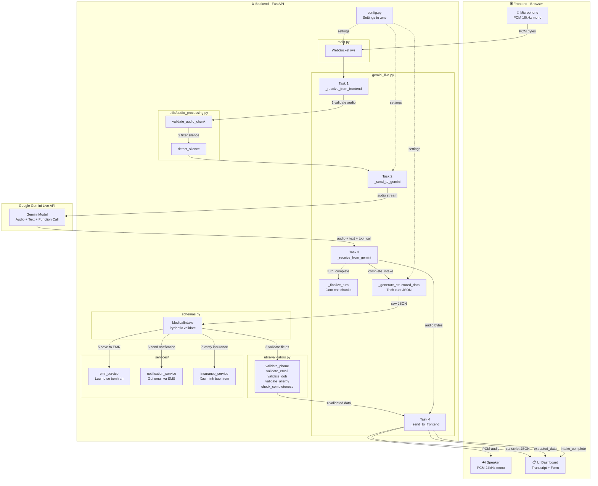

# 🏥 Medical Intake Backend — Tổng Quan Kiến Trúc

## Mục đích
Hệ thống thu thập thông tin y tế bệnh nhân qua **giọng nói** sử dụng Gemini Live API.  
Bệnh nhân nói chuyện tự nhiên → AI hỏi lần lượt → Dữ liệu y tế được trích xuất tự động.

---

## Luồng Dữ Liệu Hiện Tại (Đơn giản)

```
Browser (Mic)                    Backend                         Google
     │                              │                              │
     │── PCM audio (16kHz) ────────►│── audio stream ─────────────►│
     │                              │                              │
     │◄── PCM audio (24kHz) ───────│◄── AI audio response ───────│
     │◄── JSON (transcript) ───────│◄── text transcription ──────│
     │◄── JSON (extracted_data) ───│   (secondary extraction)     │
     │◄── JSON (intake_complete) ──│                              │
```

---

## 🔵 Pipeline Đầy Đủ (Khi Tích Hợp Tất Cả Thành Phần)



### Thứ tự xử lý khi tích hợp đầy đủ:

| Bước | File | Hành động |
|------|------|-----------|
| **①** | `audio_processing.py` | Validate audio chunk (alignment, format) trước khi gửi Gemini |
| **②** | `audio_processing.py` | Phát hiện im lặng → skip chunk rỗng để tiết kiệm bandwidth |
| **③** | `schemas.py` | Parse raw JSON → `MedicalIntake` Pydantic model (type-safe) |
| **④** | `validators.py` | Validate từng field: SĐT, email, DOB, mức độ dị ứng, đủ trường |
| **⑤** | `emr_service.py` | Lưu dữ liệu validated vào hệ thống EMR |
| **⑥** | `notification_service.py` | Gửi email/SMS xác nhận cho bệnh nhân |
| **⑦** | `insurance_service.py` | Xác minh bảo hiểm nếu bệnh nhân cung cấp thông tin BHYT |

> ⚠️ Hiện tại chỉ có luồng audio (Task 1→2→3→4) và extraction đang hoạt động.  
> Các bước ①–⑦ cần được tích hợp vào `gemini_live.py`.

---

## Cấu Trúc Thư Mục

```
voice-agent-backend/
│
├── main.py                  # FastAPI app, WebSocket endpoint /ws
├── gemini_live.py           # GeminiLiveSession — xử lý toàn bộ phiên hội thoại
├── config.py                # Settings (Pydantic) — đọc từ .env
├── schemas.py               # Pydantic models cho dữ liệu y tế
├── .env                     # Biến môi trường (API key, model, audio config)
│
├── services/                # Các service nghiệp vụ (mock)
│   ├── __init__.py
│   ├── emr_service.py       # Lưu/truy vấn hồ sơ bệnh án (EMR)
│   ├── notification_service.py  # Gửi email, SMS thông báo
│   └── insurance_service.py # Xác minh bảo hiểm y tế
│
├── utils/                   # Tiện ích
│   ├── __init__.py
│   ├── validators.py        # Validate SĐT, email, DOB, dị ứng, thuốc
│   └── audio_processing.py  # Xử lý audio (validate, đo duration, phát hiện im lặng)
│
├── pytest.ini               # Cấu hình pytest
├── .coveragerc              # Cấu hình coverage
└── requirements.txt         # Dependencies
```

---

## Chi Tiết Từng Thành Phần

### 1. `main.py` — Entry Point
**Vai trò:** Khởi tạo FastAPI app, xử lý WebSocket connection.

| Endpoint | Phương thức | Chức năng |
|----------|-------------|-----------|
| `/` | GET | Thông tin service |
| `/health` | GET | Health check |
| `/ws` | WebSocket | Stream audio 2 chiều |

**Luồng WebSocket:**
1. Client kết nối → accept
2. Xác định API key (query param hoặc `.env`)
3. Tạo `GeminiLiveSession` → gọi `session.run(websocket)`
4. Khi ngắt kết nối → `session.cleanup()`

---

### 2. `gemini_live.py` — Core Logic
**Vai trò:** Quản lý 1 phiên hội thoại hoàn chỉnh với Gemini Live API.

**4 task chạy song song trong `run()`:**

| Task | Method | Chức năng |
|------|--------|-----------|
| 1 | `_receive_from_frontend()` | Nhận audio/control từ browser |
| 2 | `_send_to_gemini()` | Chuyển tiếp audio đến Gemini |
| 3 | `_receive_from_gemini()` | Nhận response từ Gemini (audio + text + function call) |
| 4 | `_send_to_frontend()` | Gửi audio/transcript/data về browser |

**Các phương thức hỗ trợ:**

| Method | Chức năng |
|--------|-----------|
| `_generate_structured_data()` | Trích xuất dữ liệu y tế từ transcript qua Gemini |
| `_finalize_turn()` | Gom các text chunk thành turn hoàn chỉnh |
| `_get_system_instruction()` | Tạo system prompt cho AI |
| `_save_conversation_to_file()` | Lưu hội thoại ra JSON |
| `_init_session_log()` / `_log_event()` | Ghi log phiên |
| `cleanup()` | Dọn dẹp khi kết thúc |

**Sự kiện quan trọng — `complete_intake`:**
- Gemini gọi function `complete_intake()` khi đã thu thập đủ thông tin
- Backend chạy `_generate_structured_data()` → gửi `extracted_data` + `intake_complete` về frontend

---

### 3. `config.py` — Cấu Hình
**Vai trò:** Tập trung toàn bộ cấu hình, đọc từ `.env`.

| Nhóm | Fields |
|------|--------|
| API | `GEMINI_API_KEY` |
| Model | `MODEL_NAME`, `VOICE_MODEL`, `LANGUAGE_CODE` |
| Audio | `AUDIO_FORMAT`, `AUDIO_CHANNELS`, `SEND_SAMPLE_RATE`, `RECEIVE_SAMPLE_RATE` |
| Server | `HOST`, `PORT`, `CORS_ORIGINS`, `LOG_LEVEL` |
| Prompt | `CLINIC_NAME`, `SPECIALTY`, `GREETING_STYLE`, `SYSTEM_INSTRUCTION` |
| Storage | `CONVERSATION_STORAGE_PATH`, `SAVE_CONVERSATIONS`, `SESSION_LOG_PATH` |

---

### 4. `schemas.py` — Data Models
**Vai trò:** Định nghĩa cấu trúc dữ liệu y tế (Pydantic).

```
MedicalIntake (tổng hợp)
├── PatientInfo        — Tên, ngày sinh, SĐT, email
├── PresentIllness     — Triệu chứng hiện tại
│   └── ChiefComplaint — Triệu chứng chính
├── Medication[]       — Thuốc đang dùng
├── Allergy[]          — Dị ứng
├── PastMedicalHistory — Tiền sử bệnh, phẫu thuật
├── FamilyHistory      — Tiền sử gia đình
└── SocialHistory      — Hút thuốc, rượu, nghề nghiệp
```

> ⚠️ **Lưu ý:** Hiện tại `_generate_structured_data()` trong `gemini_live.py` trả về raw JSON dict, chưa validate qua các schema này. Đây là điểm có thể cải thiện sau.

---

### 5. `services/` — Service Layer (Mock)

| Service | File | Chức năng | Status |
|---------|------|-----------|--------|
| **EMRService** | `emr_service.py` | Lưu/truy vấn hồ sơ bệnh án | 🟡 Mock |
| **NotificationService** | `notification_service.py` | Gửi email, SMS xác nhận/nhắc lịch | 🟡 Mock |
| **InsuranceService** | `insurance_service.py` | Xác minh bảo hiểm, kiểm tra quyền lợi | 🟡 Mock |

> Tất cả đều là **mock** (giả lập có `asyncio.sleep`). Cần thay bằng API thực khi deploy.
> Các service chưa được gọi từ `gemini_live.py` — cần tích hợp thêm.

---

### 6. `utils/` — Utilities

| Module | Chức năng chính |
|--------|----------------|
| `validators.py` | `validate_phone_number()`, `validate_email()`, `validate_date_of_birth()`, `validate_allergy_severity()`, `sanitize_text_input()`, `validate_medical_record_completeness()` |
| `audio_processing.py` | `AudioProcessor` — validate audio chunk, tính duration, phát hiện im lặng |

> Các validator chưa được tích hợp vào luồng chính. Có thể dùng để validate `extracted_data` trước khi gửi về frontend.

---

## Dependencies (`requirements.txt`)

| Package | Vai trò |
|---------|---------|
| `fastapi` | Web framework + WebSocket |
| `uvicorn[standard]` | ASGI server |
| `websockets` | WebSocket protocol |
| `google-genai` | Gemini Live API client |
| `pydantic` | Data validation |
| `pydantic-settings` | Settings management từ `.env` |
| `python-multipart` | Form data parsing |
| `python-dotenv` | Đọc `.env` file |
| `aiofiles` | Async file I/O |

### Cần thêm cho testing:
```
pytest
pytest-asyncio
pytest-cov
httpx              # TestClient cho FastAPI
```
